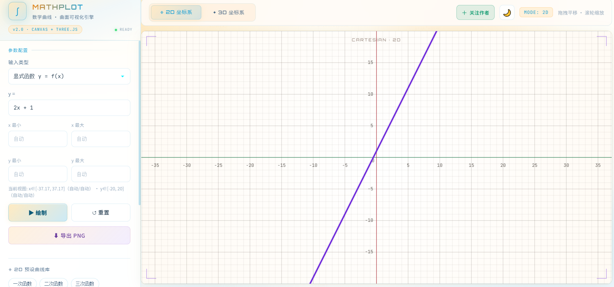
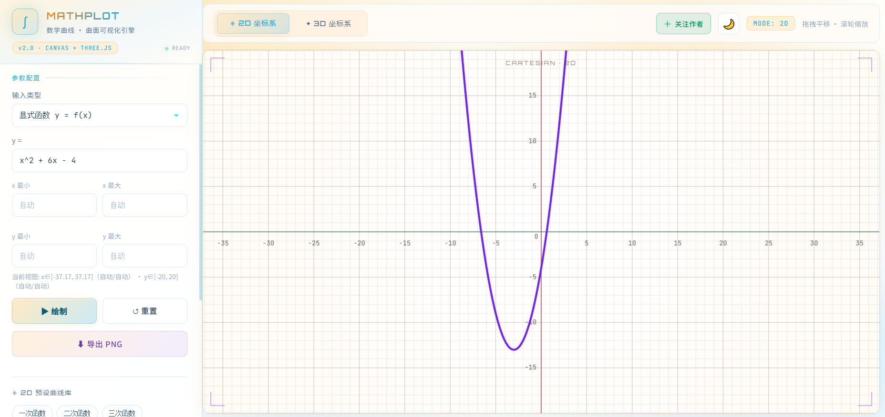
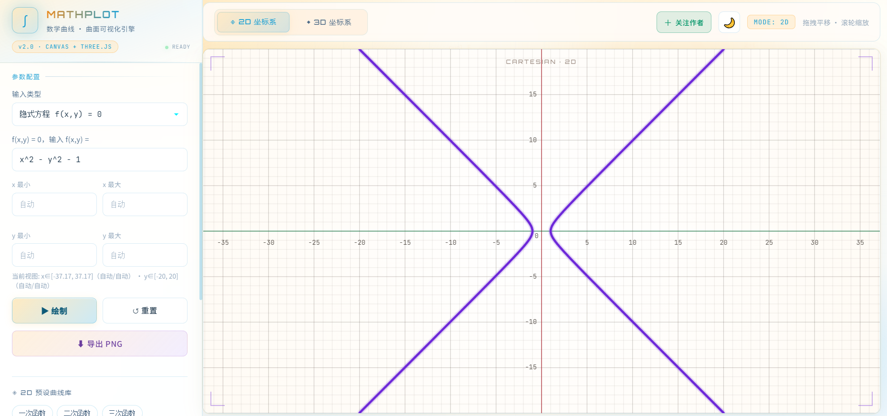
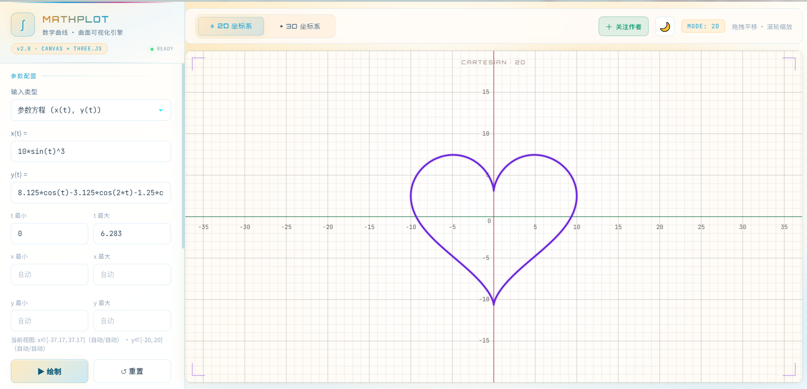
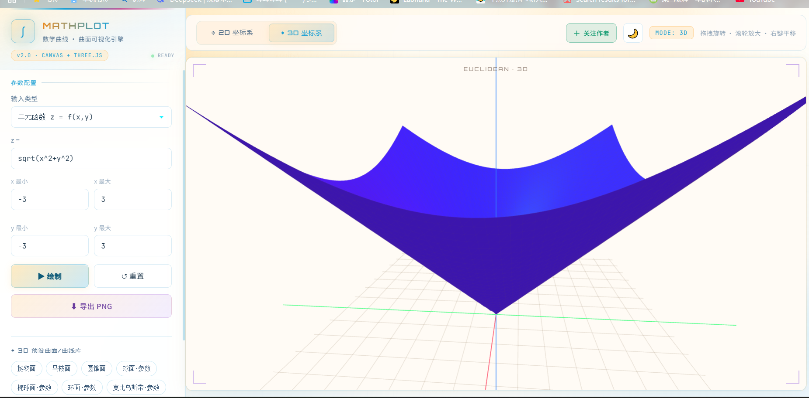
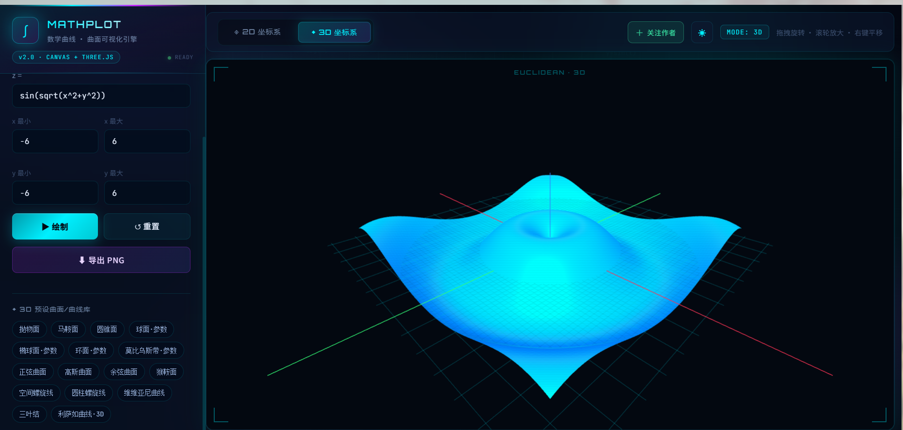
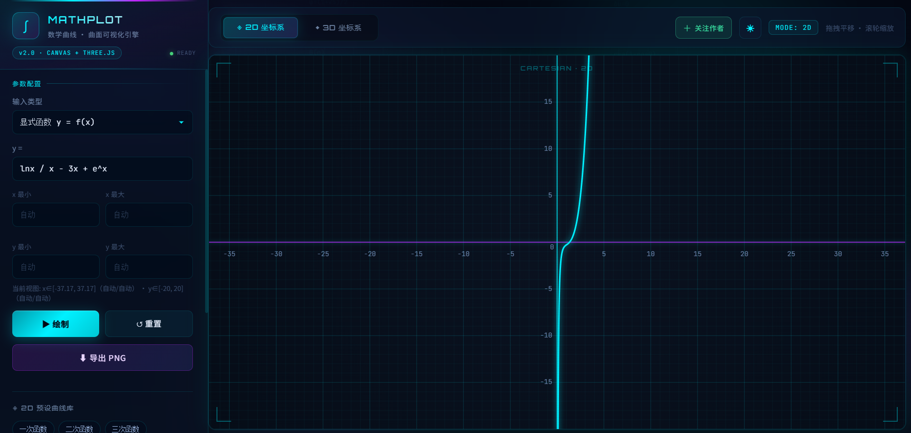
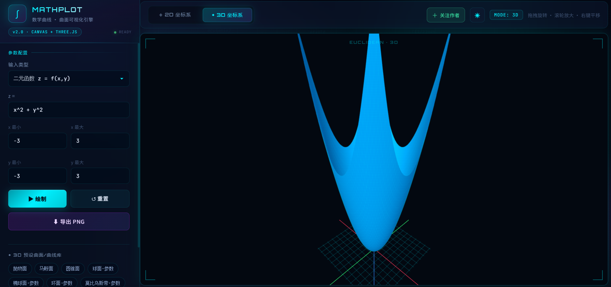

# MathPlot · 数学曲线绘制

浏览器端数学曲线与曲面可视化引擎。支持显式函数、参数方程、隐式方程、**图片轮廓转参数曲线**，以及 3D 曲面与空间曲线。  
单 HTML 文件，双击 `index.html` 即可使用，无需安装。

English: In-browser math curve & surface plotter — explicit, parametric, implicit equations, image-to-contour curves, 3D surfaces. Single HTML, zero install.

---

## 界面预览

### 2D 曲线

| 显式函数 | 二次函数 |
| :---: | :---: |
|  |  |

| 隐式方程 | 参数方程（心形线） |
| :---: | :---: |
|  |  |

### 3D 曲面

| 圆锥面 z=√(x²+y²) | 波纹曲面 |
| :---: | :---: |
|  |  |

| 深色主题 · 2D | 深色主题 · 3D 抛物面 |
| :---: | :---: |
|  |  |

---

## 功能特性

- **2D 绘图**
  - 显式函数 `y = f(x)`
  - 参数方程 `(x(t), y(t))`
  - 隐式方程 `f(x, y) = 0`
  - **图像轮廓 → 参数曲线**：上传 PNG/JPG，自动提取主轮廓并映射为 `(x(t), y(t))`
- **3D 可视化**（Canvas + Three.js）
  - 二元函数 `z = f(x, y)`
  - 空间参数曲线 `(x(t), y(t), z(t))`
- **内置预设库**：一次/二次/三次函数、心形线、玫瑰线、双曲函数，以及抛物面、马鞍面、球面、环面、莫比乌斯带等
- **交互操作**
  - 2D：拖拽平移、滚轮缩放
  - 3D：左键旋转、滚轮缩放、右键平移
- **导出 PNG**、深浅色主题切换
- **多语言界面**（中 / 英）

## 快速开始

1. 下载或克隆本仓库
2. 用浏览器打开 `index.html`（Chrome / Edge / Firefox 推荐）
3. 在左侧输入公式，点击 **绘制**

本地预览（可选）：

```bat
# Python 3
python -m http.server 8080
# 浏览器访问 http://localhost:8080
```

> 直接双击 `index.html` 即可使用；若需加载本地图片轮廓，建议通过本地 HTTP 服务打开。

## 技术栈

- HTML5 Canvas（2D）
- [Three.js](https://threejs.org/)（3D）
- 纯前端，无后端依赖

## 作者

- B 站：[space.bilibili.com/259516939](https://space.bilibili.com/259516939)
- Steam《萝薇日记》：[store.steampowered.com/app/4448620](https://store.steampowered.com/app/4448620/_/)

## License

MIT © 星薇Star
